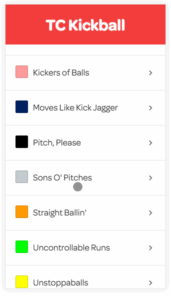

# TC Kickball

A React Web App showing our Twin Cities Kickball league schedule.



### Getting started

Clone the repo

```bash
git clone https://github.com/stursby/tckickball.com.git && cd tckickball.com
```

Install `npm` dependecies

```bash
npm install
```


### Run

You can run the TC Kickball app locally with the following:

```bash
npm run dev
```

### Build

To build for production, run the following: (scripts will be generated in the `/dist` folder)

```bash
npm run build
```
